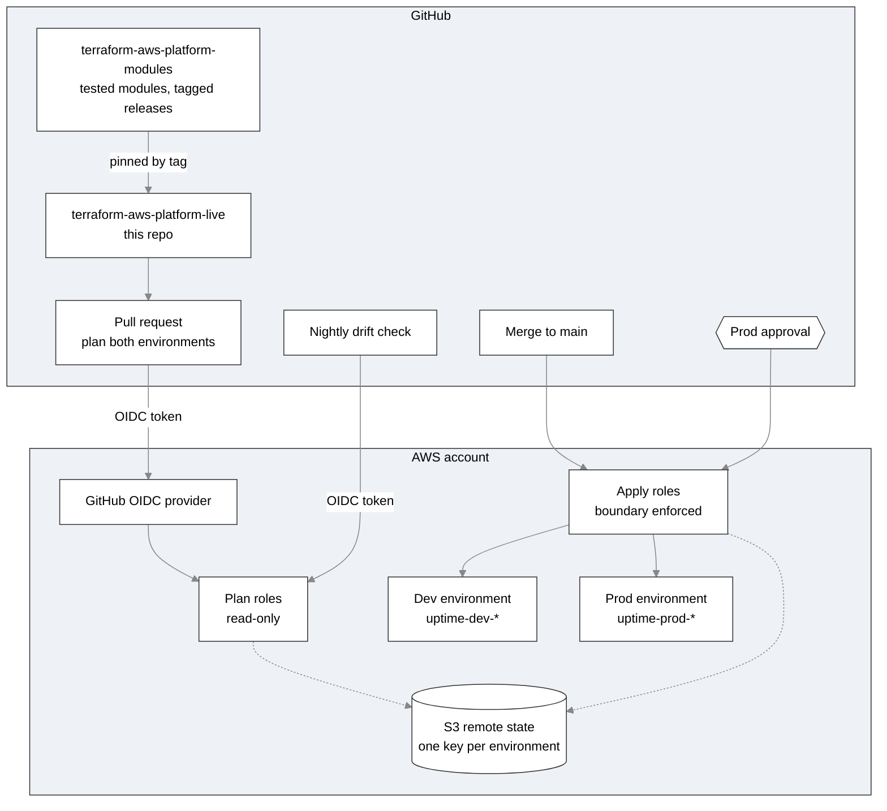

# terraform-aws-platform-live

Live infrastructure for an uptime monitoring platform on AWS. Two environments, dev and prod, are built from a separate, versioned module library and deployed only through GitHub Actions, with an approval required before anything reaches prod.

The platform checks a list of URLs every five minutes, records the results, emails an alert when a check fails, and publishes a public status page from a private S3 bucket through CloudFront.

This is a personal learning project, designed to show how Terraform is run inside a team rather than from one laptop.

## Architecture



Each environment contains:

- **Monitor:** EventBridge Scheduler runs a Python Lambda every five minutes. It checks each URL, writes results to DynamoDB, writes the current status to `status.json`, and publishes failures to SNS.
- **Alerts:** an encrypted SNS topic that only the monitor's role can publish to, with email subscriptions.
- **Status page:** a private S3 bucket served through CloudFront with Origin Access Control.
- **Guardrails:** a permissions boundary that caps every role the platform creates, and a monthly budget alert.

## Repository layout

```
.
├── .github/workflows/
│   ├── terraform.yml     plan on pull requests, apply on merge
│   └── drift.yml         nightly drift detection
├── bootstrap/            OIDC provider and pipeline roles (applied by an administrator)
├── envs/
│   ├── dev/              dev environment
│   └── prod/             prod environment
└── docs/
    ├── adr/              architecture decision records
    ├── runbook.md        how to handle common problems
    └── standards.md      naming, tagging, and state rules
```

## How a change reaches production

1. **Pull request:** both environments are planned with read-only roles. A comment on the pull request shows each plan's summary, and the full plan is in the workflow log with secrets masked.
2. **Merge:** a job works out which environments changed.
3. **Dev:** if dev changed, it is applied automatically.
4. **Prod:** if prod changed, the job waits for a reviewer to approve it in GitHub, then applies.

Module upgrades follow the same path. A new module release is pinned in dev first, and prod is upgraded only by a later pull request that changes its pinned tag.

## Environments

| | Dev | Prod |
|---|---|---|
| Resource prefix | `uptime-dev` | `uptime-prod` |
| State key | `platform/dev/terraform.tfstate` | `platform/prod/terraform.tfstate` |
| Deploys | Automatically on merge | After approval |
| DynamoDB point-in-time recovery | Off | On |
| Log retention | 7 days | 14 days |

## Security design

- **No stored AWS keys.** GitHub Actions authenticates with short-lived OIDC tokens.
- **Separate plan and apply roles per environment.** Plan roles are read-only. A dev role cannot touch prod, because every permission is scoped to the environment's resource prefix.
- **The approval gate is enforced in AWS, not just in GitHub.** The prod apply role trusts only tokens issued to jobs in the protected `prod` GitHub Environment, which requires a reviewer and accepts only `main`.
- **Trust policies match immutable IDs.** The OIDC `sub` condition includes the numeric account and repository IDs, so a recreated repository with the same name cannot inherit trust.
- **No privilege escalation through the pipeline.** Apply roles can create IAM roles only when they carry the workload permissions boundary, cannot remove or edit that boundary, and can pass roles only to Lambda and EventBridge Scheduler. The pipeline roles are named outside the prefix they manage, so they cannot modify themselves.
- **The bootstrap is never applied by the pipeline.** An administrator applies it, because a pipeline that could change its own roles could grant itself anything.
- **Secrets stay out of the repository.** The account ID, state bucket, and alert email live in GitHub secrets and Git-ignored files. Public pull request comments and issues carry only plan summaries.

## Drift detection

A scheduled workflow plans both environments every night with the read-only roles, using `terraform plan -detailed-exitcode`. If real infrastructure no longer matches the code, it opens a `Drift detected: <env>` issue, or comments on the open one. A clean run closes it.

## Design decisions

The reasoning behind each major choice is recorded in [`docs/adr`](docs/adr):

1. [Separate module and live repositories](docs/adr/0001-separate-module-and-live-repositories.md)
2. [Least-privilege pipeline roles](docs/adr/0002-least-privilege-pipeline-roles.md)
3. [CloudFront for the status page](docs/adr/0003-cloudfront-for-status-page.md)
4. [Promotion by version bump](docs/adr/0004-promotion-by-version-bump.md)
5. [Bootstrap owns pipeline identity](docs/adr/0005-bootstrap-owns-pipeline-identity.md)

## Cost

The platform is designed to stay within AWS free allowances, apart from a few cents a month in S3 requests. There are no servers, no NAT gateways, and no VPC. Budget alerts email at 80% of actual spend and when forecast spend will pass the monthly limit.

## Known limitations

- Both environments share one AWS account. A real setup would separate accounts for stronger isolation.
- CloudFront resources get random IDs, so the apply roles' CloudFront permissions use `Resource = "*"`.
- Prod keeps `force_destroy` on for the status bucket, because the environment is meant to be torn down when the project ends.
- A target that stays down sends an alert on every check. There is no deduplication.
- The status page has no WAF, no access logging, and no custom domain, to avoid their cost.
- The pipeline roles' policies were written by hand and may need an action added when the modules change.

## What I learned

- **Read the destroy count before every apply.** A bootstrap plan showed 21 resources to destroy because its backend file still used the dev state key. Catching it in the plan meant nothing was lost.
- **CloudTrail shows what an OIDC token actually contained.** A generic "not authorized" error turned out to be a `sub` claim that included numeric IDs the trust policy did not expect.
- **A test checks only what it asserts.** A misspelled policy condition key passed every test, because the tests checked the operator but not the key. The fix added a test for the exact key before changing the code.
- **A tag goes on whatever commit you are on.** A patch release was tagged before the fix was pulled, so it pointed at the old code. A plan with no changes after a fix was the warning sign.
- **Re-running a workflow reuses its original commit,** so change detection gives the same answer. A small real change gets a fresh, reviewed plan instead.
- **Validate drift detection with real drift.** Changing a log group's retention in the console opened an issue, and reverting it closed the issue on the next run.

## Teardown

See the teardown section of the [runbook](docs/runbook.md). Order matters, because the pipeline roles and the state bucket must outlive the environments they manage.
